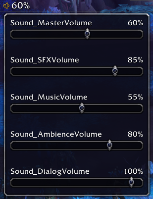

# Volume

This project provides a lib-data-broker display compatible volume control more in line with how human ears work.

Currently tested with

* ChocolateBar

In most games, volume sliders have a linear output power scale, and WoW is among those. But our ears are not linear, which makes finding the right volume level harder than it has to be.

## Example

